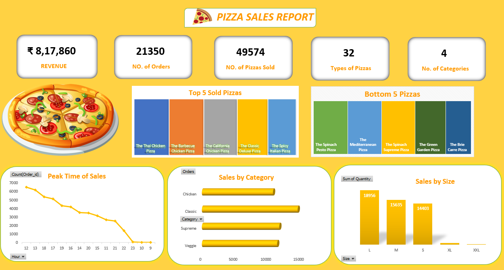

# 🍕 Pizza Sales Report Dashboard

## Overview:
This project is a comprehensive analysis of pizza sales data, visualized using an interactive dashboard. The dashboard provides insights into various sales metrics such as total revenue, number of orders, top-selling pizzas, peak sales hours, and more. It aims to quickly understand key performance indicators and make data-driven decisions.

## DashBoard: 

## Key Features:

Total Revenue: Displays the overall revenue generated.

Number of Orders: Shows the total number of orders made.

Number of Pizzas Sold: Reflects the total quantity of pizzas sold.

Types of Pizzas: Indicates the number of different pizza types available.

Top & Bottom 5 Sold Pizzas: Highlights the best and least popular pizzas.

Peak Time of Sales: Provides insights into the busiest hours, helping optimize staffing and inventory.

Sales by Category: Visualizes sales based on pizza categories (e.g., Chicken, Classic, Supreme, Veggie).

Sales by Size: Breaks down sales by pizza size, showing preferences for size options.

## Technologies Used:

SQL: Used for data extraction, and transformation. SQL queries were written to organize data by order counts, revenue, categories, and peak sales hour

Excel: Used for data visualization, creating an interactive and visually appealing dashboard.

## Data Processing with SQL

Data preparation and transformations were done using SQL, including:

Data Cleaning: Removing duplicates, handling missing values.

Data Aggregation: Grouping data by categories, pizza types, sizes, and time to get meaningful insights.

Revenue Calculation: Aggregating data to calculate total revenue from all orders.

Peak Hours Identification: Using SQL to identify peak order times by grouping orders by hour.

## Visualization Insights

The dashboard was created to provide easy-to-read visualizations of the processed data:

KPIs: High-level metrics like revenue and total orders are shown prominently for quick reference.

Top & Bottom 5 Sold Pizzas: A horizontal bar chart helps identify customer preferences and areas to improve.

Peak Time of Sales: Line chart shows sales distribution over the hours, identifying peak sales times.

Sales by Category & Size: Visualized using bar charts, making it easy to see which pizza categories and sizes are most popular.

## Insights and Analysis

Peak Hours: The busiest sales times are between 12 PM to 9 PM, helping plan staffing during high-demand periods.

Customer Preferences: The Thai Chicken Pizza and Barbecue Chicken Pizza are top sellers, while pizzas like the Spinach Pesto and Green Garden Pizza are less popular.

Size Preferences: The "Large" size is the most ordered, indicating customer preference, while "XL" and "XXL" have very few orders.

## Recommendations
Based on the data analyzed in the Pizza Sales Report, here are some recommendations to help increase revenue and optimize sales:

 Promote Best-Selling Pizzas

The top 5 sold pizzas, including The Thai Chicken Pizza and The Barbecue Chicken Pizza, have proven popular among customers. It’s beneficial to highlight these in promotions or meal deals. Consider bundling them with sides and drinks to boost the average order value.
Revamp or Discontinue Low-Selling Pizzas

Some pizzas, such as The Spinach Pesto Pizza and The Green Garden Pizza, are among the least popular items. These pizzas could be revamped with new ingredients or marketed to target audiences (e.g., health-conscious customers). If sales don’t improve, consider discontinuing them to focus resources on higher-selling items.
Optimize Peak Hours for Sales

The peak sales time occurs between 12 PM and 7 PM. Consider increasing staff and resources during these hours to improve efficiency and reduce wait times. Additionally, launching happy-hour deals just before the peak hours could help extend high sales periods.
Expand Large Size Options

The data indicates that large pizzas are the most popular size. To capitalize on this trend, introduce more variety in the large size or offer additional toppings and premium ingredients for large pizzas to attract more customers.
Focus on Chicken and Veggie Categories

The analysis shows that Chicken and Veggie categories are the most popular. Invest in new recipes or expand the menu with more options in these categories. These can also be highlighted in social media marketing campaigns to reach a broader audience.
Test New Flavors and Limited-Time Offers

To attract repeat customers and maintain excitement, consider introducing limited-time flavors or seasonal pizza options. Customer feedback on these new flavors can be gathered to identify potential new menu items.
Encourage Upselling for Medium and Small Sizes

Since large pizzas are highly preferred, create upselling strategies to encourage customers who purchase medium or small sizes to upgrade to a large. This could involve showing the value difference or offering discounts on larger sizes.
Run Targeted Campaigns for Underperforming Time Slots

Sales tend to decline significantly in the late evening and early morning. Offer discounts, exclusive deals, or special offers during these off-peak times to boost sales and make better use of operational hours.

